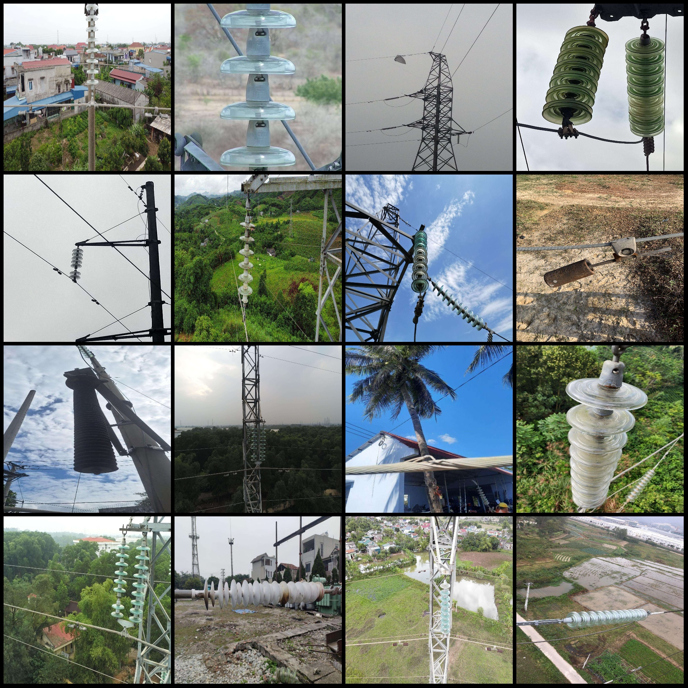
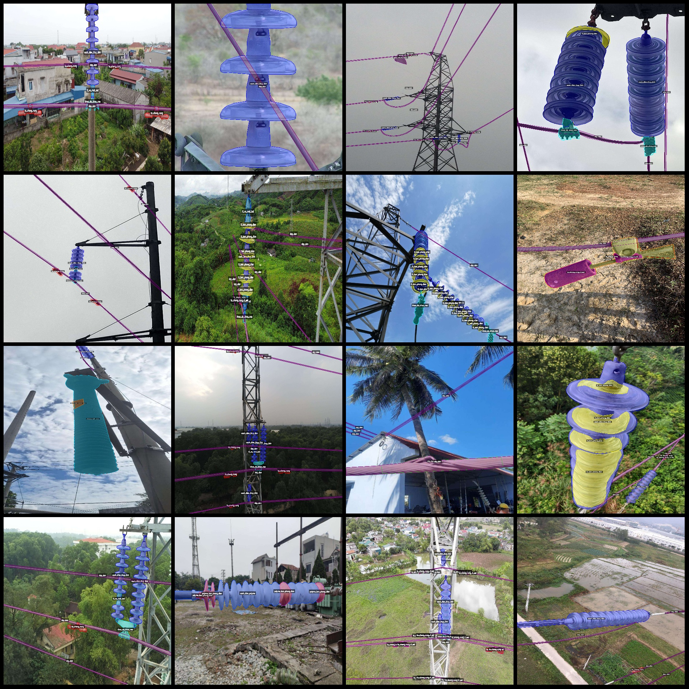
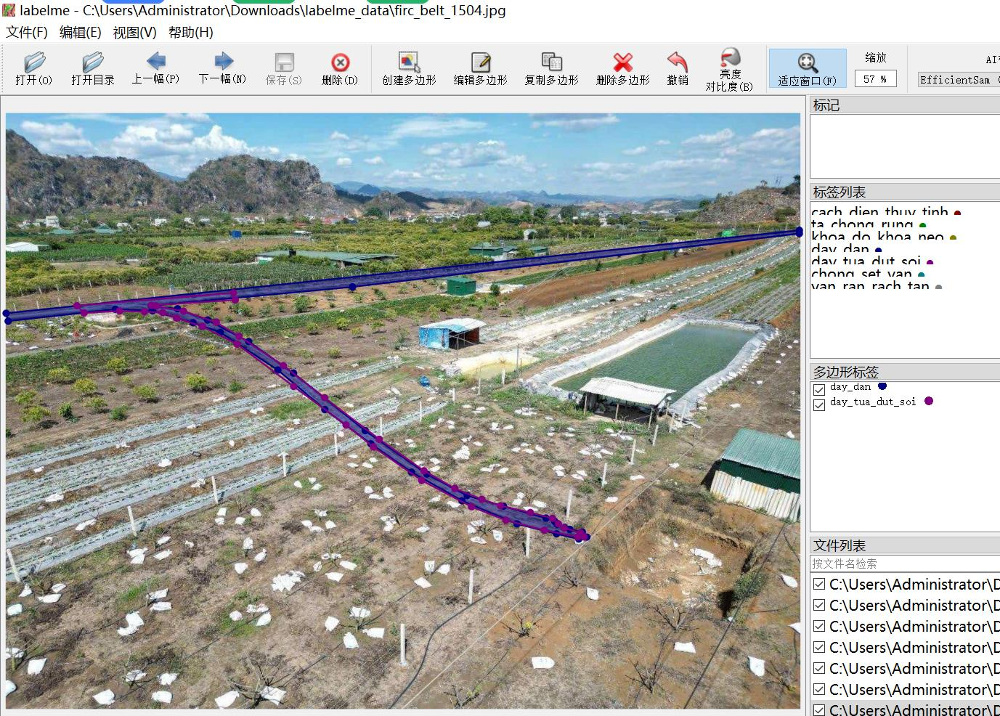

# Power Scene 2752 Images with 21 Categories for Transmission Line Components Identification and Segmentation in LabelMe format

Dataset format: labelme format (excluding mask files, only containing jpg images and corresponding json files)
Number of image files (jpg file counts): 2752
Number of annotation files (json file counts): 2752
Number of annotation categories: 21
Annotation category names: ["cach_dien_thuy_tinh", "ta_chong_rung", "khoa_do_khoa_neo", "day_dan", "tt_vo_mat_bat", "chong_set_van", "van_ban", "cach_dien_polyme", "polyme_cong_venh", "polyme_ban_phong_dien", "polyme_rach", "tt_ban_phong_dien", "day_ban_phong_dien", "ta_chong_rung_ri_set", "day_tua_dut_soi", "day_vat_la_bam", "mat_ta", "van_ran_rach_tan", "van_phong_dien_bien_dang", "mat_bulong", "long_bulong"]
Count of bounding boxes for each category:
cach_dien_thuy_tinh (glass insulator) count = 4035
ta_chong_rung (seismic anchor) count = 2892
khoa_do_khoa_neo (latch/lock) count = 2129
day_dan (conductor) count = 6570
tt_vo_mat_bat (transformer housing) count = 1027
chong_set_van (leak detector) count = 533
van_ban (valve) count = 845
cach_dien_polyme (composite insulator) count = 563
polyme_cong_venh (composite insulator deformed) count = 174
Polymer-bonded insulator corona discharge count = 2146
Polymer-bonded insulator crack count = 505
Transformer corona discharge count = 2887
Wire corona discharge count = 386
Anti-vibration hammer rust count = 1887
Support wire break count = 266
Support wire foreign matter adhesion count = 77
Tower component count = 232
Valve rust and crack count = 429
Valve discharge deformation count = 197
Bearing bolt nut count = 73
Bearing bolt shaft count = 125
Total box count: 27978  
Usage labeler tool: labelme=5.5.0  
Location in the warehouse: firc-dataset
Image resolution: Multi-resolution images, such as 1920x3016, 1920x1080, etc.
Annotation rules: Polygons for class drawing
Important Notice: You can open and edit the dataset using labelme. The JSON dataset needs to be converted into mask or Yolo format or Coco format for semantic segmentation or instance segmentation.
Special Disclaimer: This dataset does not guarantee the accuracy of the trained model or weight files.
Image Preview:
## Images

Here is a pay link on Stripe ( https://buy.stripe.com/3cs8yP7sY87d0vu9AB ). Please contact me lonlonago@foxmail.com after funding $89, and I will send you a complete data files , thank you!

